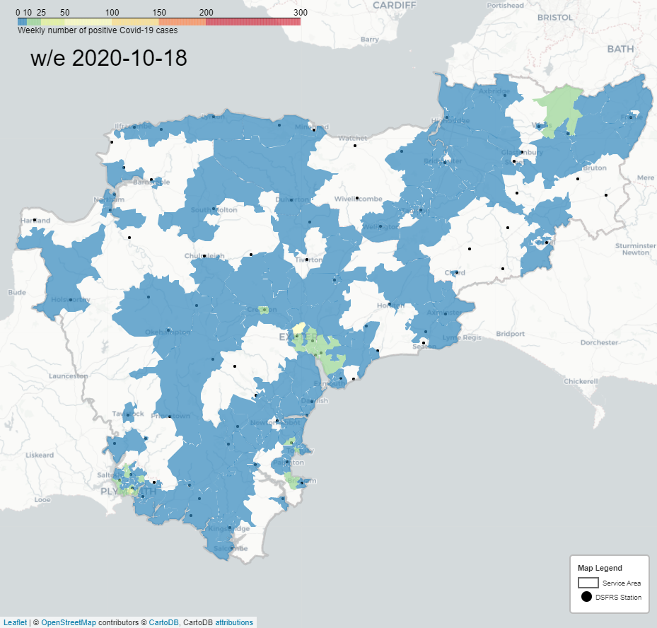

[](https://mybinder.org/v2/gh/PhilPearson83/CV19_Choropleth/main?filepath=CV19_Choropleth.ipynb)

# Guide to creating a Covid-19 Choropleth

The map utilises open source data avaialable from the UK Government or ONS. The map focues on the South West of England but can be adapted for the whole of the UK.

[GOV.UK Coronavirus (COVID-19) in the UK](https://coronavirus.data.gov.uk/about-data)

[ONS Open Geography Portal](https://geoportal.statistics.gov.uk/)



# Pre-requisites


# Directory Layout

```
.
├── data
│   ├── geospatial
│   │   ├── DSFRS_Service_Area.cpg
│   │   ├── DSFRS_Service_Area.dbf
│   │   ├── DSFRS_Service_Area.prj
│   │   ├── DSFRS_Service_Area.qpj
│   │   ├── DSFRS_Service_Area.shp
│   │   ├── DSFRS_Service_Area.shx
│   │   ├── MSOAs.cpg
│   │   ├── MSOAs.dbf
│   │   ├── MSOAs.prj
│   │   ├── MSOAs.shp
│   │   ├── MSOAs.shx
│   └── images
│   │    ├── SampleMap.gif
├── example
│   ├── positive_cases_wk_42.png
│   └── SampleMap.gif
├── └── dsfrs_stations.csv
├── .gitignore
├── CV19_Choropleth.ipynb
├── CV19_Choropleth_with_gif_output.ipynb
├── CV19_Choropleth_with_gif_output_alt.ipynb
├── Licence
├── README.md
└── requirements.txt
```

# Running the sample

## Step 1 : Start Python, create a virtual env and instal requirements

``` python
python -m venv env
.\venv\Scripts\activate
pip install -r requirements.txt
```

## Step 2 : Execute Code 

Open `CV19_Choropleth_with_gif_output.ipynb` file and rull all cells.

## Step 3 : Browse the created gif

The gif can be found at `./images/`
